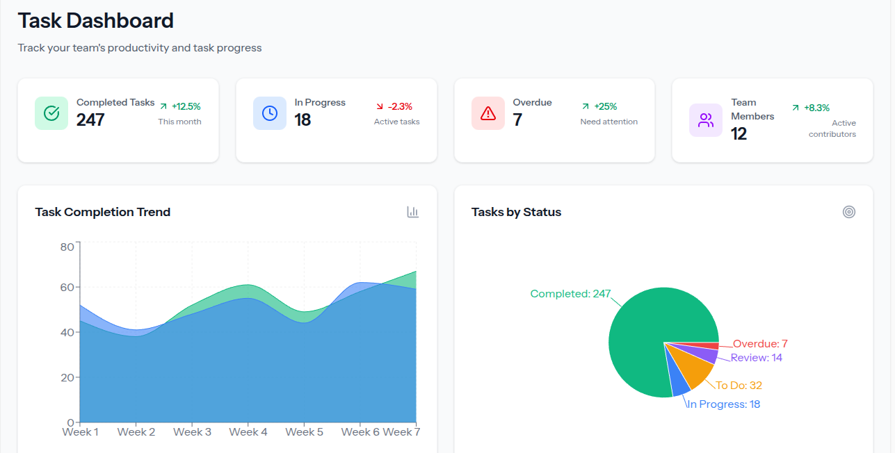
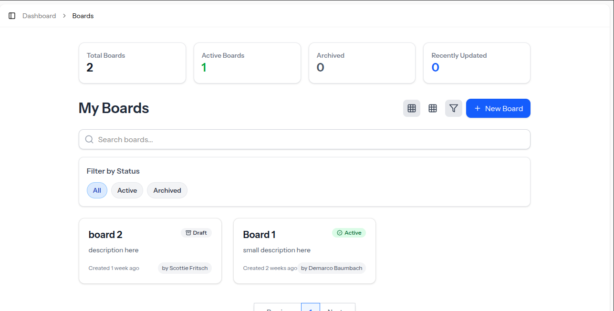

# BoardFlow - Modern Board Management Platform


BoardFlow is a feature-rich, flexible board management platform designed to help teams organize, track, and collaborate on projects and ideas. With a clean, intuitive interface and powerful features, BoardFlow makes it easy to manage tasks, roadmaps, and feedback in one centralized location.

## 🌟 Features

### Board Management
- **Multiple Board Types**: Create different types of boards including Kanban, Roadmap, Ideas, and more
- **Customizable Status & Workflow**: Tailor board workflows to match your team's process
- **Team Management**: Collaborate with team members with granular permission controls
- **Public & Private Boards**: Control access to sensitive information

### Item Management
- **Flexible Items**: Create, organize and track tasks, ideas, or feedback
- **Custom Statuses**: Assign statuses that match your workflow
- **Priority Levels**: Categorize items by importance
- **Assignees**: Delegate items to team members
- **Due Dates**: Set deadlines and track progress

### Collaboration
- **Voting System**: Allow members to vote on items to prioritize work
- **Commenting**: Discuss items with team members
- **Activity Tracking**: Keep a detailed history of actions on each board and item
- **Real-time Updates**: Stay informed about changes and progress

### User Experience
- **Modern Interface**: Clean, intuitive UI built with Tailwind CSS
- **Responsive Design**: Works seamlessly on desktop and mobile devices
- **Dark Mode Support**: Reduce eye strain with dark mode option
- **Customizable Dashboard**: Personalize your view with the information that matters most

## 🖼️ Screenshots

### 🔹 Dashboard – Project Overview  
Get a clear snapshot of active boards, tasks, and progress.



---

### 🔹 Boards Index – Organize Projects Visually  
Quickly access and manage all your boards with a clean layout.




## 🚀 Technology Stack

### Backend
- **Laravel**: PHP framework providing a robust foundation
- **PostgreSQL**: Powerful relational database for data storage
- **Inertia.js**: Server-side rendering with client-side reactivity

### Frontend
- **React**: Modern JavaScript library for building user interfaces
- **Tailwind CSS**: Utility-first CSS framework for rapid UI development
- **Headless UI**: Unstyled, accessible UI components for customization
- **Lucide Icons**: Beautiful, consistent icon set

## 📋 Getting Started

### Prerequisites
- PHP 8.1+
- Composer 2.0+
- Node.js 16+
- npm or yarn
- PostgreSQL 13+

### Installation

1. Clone the repository
```bash
git clone https://github.com/yourusername/boardflow.git
cd boardflow
```

2. Install PHP dependencies
```bash
composer install
```

3. Install JavaScript dependencies
```bash
npm install
# or
yarn install
```

4. Copy the environment file and configure your database
```bash
cp .env.example .env
# Edit .env file with your database credentials
```

5. Generate application key
```bash
php artisan key:generate
```

6. Run migrations and seed the database
```bash
php artisan migrate --seed
```

7. Build frontend assets
```bash
npm run dev
# or for production
npm run build
```

8. Start the development server
```bash
php artisan serve
```

9. Visit `http://localhost:8000` in your browser

## 🌐 Deployment

### Server Requirements
- PHP 8.1+
- Nginx or Apache
- PostgreSQL 13+
- Composer
- Node.js (for building assets)

### Deployment Steps

1. Clone repository on your server
2. Install dependencies (composer install, npm install)
3. Configure environment variables
4. Run migrations (php artisan migrate)
5. Build assets (npm run build)
6. Configure web server (Nginx/Apache)
7. Set up SSL certificate for secure connections
8. Configure caching for optimal performance

## 🗂️ Project Structure

```
boardflow/
├── app/                      # Application code
│   ├── Http/
│   │   ├── Controllers/      # Controllers for handling requests
│   │   ├── Resources/        # API resources for data transformation
│   │   └── Requests/         # Form requests for validation
│   ├── Models/               # Eloquent models
│   └── Policies/             # Authorization policies
├── database/
│   ├── migrations/           # Database migrations
│   └── seeders/              # Database seeders
├── resources/
│   ├── js/                   # JavaScript and React components
│   │   ├── Components/       # Reusable UI components
│   │   ├── Layouts/          # Layout components
│   │   ├── Pages/            # Page components for Inertia.js
│   │   └── app.jsx           # Main application entry point
│   └── views/                # Blade templates
├── routes/                   # Application routes
│   ├── web.php               # Web routes
│   └── api.php               # API routes
└── public/                   # Publicly accessible files
```

## 📊 Data Models

### Core Entities
- **Users**: Authentication and identity
- **Teams**: Groups of users for collaboration
- **Boards**: Main containers for organizing items
- **BoardTypes**: Templates for different types of boards
- **BoardItems**: Tasks, ideas, or other tracked elements
- **Comments**: Discussions on board items
- **Votes**: User preferences for prioritization
- **Activities**: Audit log of actions

## 🔒 Security Features

- **Authentication**: Secure login and registration
- **Authorization**: Role-based access control
- **CSRF Protection**: Protection against cross-site request forgery
- **XSS Prevention**: Protection against cross-site scripting
- **SQL Injection Protection**: Parameterized queries and ORM
- **Data Validation**: Comprehensive input validation

## 🔄 API Documentation

BoardFlow provides a comprehensive API for integration with other tools:

- **Authentication**: OAuth2 for secure API access
- **RESTful Endpoints**: Standard CRUD operations
- **JSON Response**: Well-structured API responses
- **Rate Limiting**: Protection against abuse
- **Pagination**: Efficient handling of large datasets

## 🤝 Contributing

Contributions are welcome! Please feel free to submit a Pull Request.

1. Fork the repository
2. Create your feature branch (`git checkout -b feature/amazing-feature`)
3. Commit your changes (`git commit -m 'Add some amazing feature'`)
4. Push to the branch (`git push origin feature/amazing-feature`)
5. Open a Pull Request

## 📝 License

[MIT License](LICENSE) - See the LICENSE file for details.

## 📞 Support

For support, email mohamedztn3@gmail.com or open an issue on GitHub.

## 🙏 Acknowledgments

- [Laravel](https://laravel.com/)
- [React](https://reactjs.org/)
- [Tailwind CSS](https://tailwindcss.com/)
- [Inertia.js](https://inertiajs.com/)
- [Headless UI](https://headlessui.dev/)
- [Lucide Icons](https://lucide.dev/)
